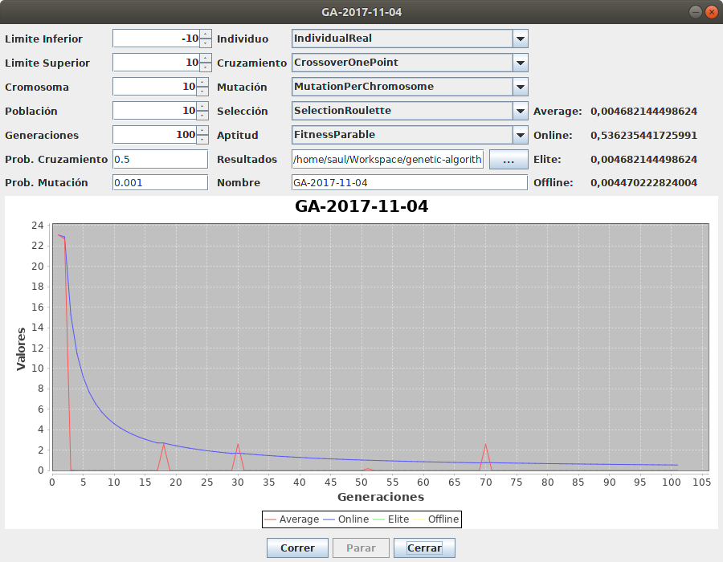

GeneticAlgorithm
============

Descripción
-----------
 En los años 1970, de la mano de John Henry Holland, surgió una de las líneas más prometedoras
 de la inteligencia artificial, la de los algoritmos genéticos. Son llamados así
 porque se inspiran en la evolución biológica y su base genético-molecular. Estos algoritmos
 hacen evolucionar una población de individuos sometiéndola a acciones aleatorias semejantes a
 las que actúan en la evolución biológica (mutaciones y recombinaciones genéticas), así como
 también a una selección de acuerdo con algún criterio, en función del cual se decide cuáles
 son los individuos más adaptados, que sobreviven, y cuáles los menos aptos, que son descartados.
 Los algoritmos genéticos se enmarcan dentro de los algoritmos evolutivos, que incluyen también las
 estrategias evolutivas, la programación evolutiva y la programación genética.

- Copyright: 2014 Saúl Piña <sauljabin@gmail.com>
- Repository: https://github.com/sauljabin/genetic-algorithm
- License: MIT
- Language: Java

Comandos
--------

```
make run

make clean
```

Screenshots
------------

